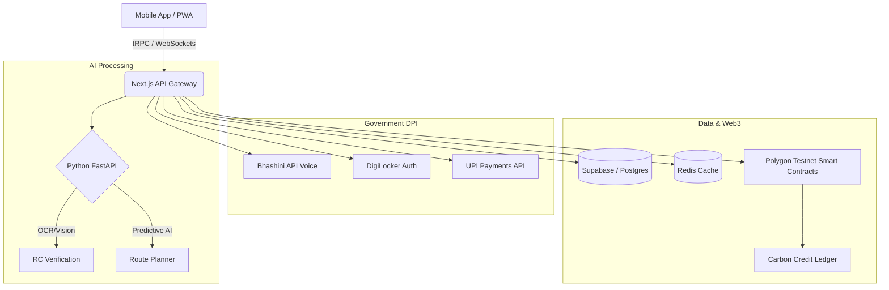

# NIAT Hackathon Proposal: Project "Urja-85" (ऊर्जा-85)

# 🇮🇳 Urja-85: Fueling New India (Net Zero 2070)

**Project Name:** Urja-85 ("Urja" = Energy; "85" = E85 Ethanol Blend) ecosystem designed to accelerate the adoption of Ethanol-blended fuels (E85) in India by connecting consumers, fuel infrastructure, and the agricultural sector (Annadata) in one seamless platform.

## Topic Selected: E85 / Ethanol — Improving awareness, adoption or use of alternative fuels.

**Why this will win:** The Government of India is aggressively pushing for ethanol blending (E20 to E85) to reduce oil imports and empower farmers. However, citizen adoption is hindered by lack of awareness, engine compatibility anxiety, and infrastructure discovery. An application that solves these bottlenecks while providing a gamified, patriotic incentive loop has massive economic and environmental impact potential. It aligns perfectly with "Atmanirbhar Bharat" (Self-reliant India).

## Project Vision
**Urja-85** is a comprehensive, AI-powered ecosystem designed to accelerate the adoption of Ethanol-blended fuels (E85) in India by connecting consumers, fuel infrastructure, and the agricultural sector (Annadata) in one seamless platform.

## 🎨 UI/UX Design Strategy (Dynamic, Attractive, Patriotic)
The UI must feel premium, eco-friendly, and deeply patriotic, combining modern web trends with Indian motifs.

*   **Color Palette:** "Harit Kranti" (Green Revolution) - Vibrant Emerald Green, Deep Saffron (#FF9933), Crisp White, and dark earthy tones for backgrounds to make the neon accents pop.
*   **Theme:** Glassmorphism with liquid/fluid animations (resembling clean fuel). 
*   **Micro-animations:** 
    *   A dynamic "fuel gauge" that fills up with green liquid when showing CO2 saved.
    *   Subtle growing crop animations when displaying farmer impact.
    *   Animated India map showing real-time E85 adoption hotspots.
*   **Typography:** Modern geometric fonts (e.g., 'Outfit' or 'Plus Jakarta Sans') to look like a high-end EV/automotive app.
*   **Data Visualization:** 3D charts showing emission reductions and economic benefits to the country.

## 🚀 Innovative "Market-First" Features

1.  **AI Engine Compatibility Scanner:** Users simply scan their vehicle's RC (Registration Certificate) or enter the model. An AI (OCR + Database) instantly confirms if the engine is E85/Flex-Fuel compatible, or suggests authorized Flex-Fuel conversion kits nearby.
2.  **Kisan Connect (Direct Farmer Impact):** This is the emotional/patriotic hook. For every liter of E85 purchased, the dashboard calculates and shows the direct economic contribution to Indian sugarcane/grain farmers (e.g., *"Your fuel up today kept ₹350 in the Indian farming economy rather than foreign oil imports"*).
3.  **Real-Time "Green Route" & E85 Pump Locator:** Not just a map of pumps, but a route planner that plots trips based on E85 availability. It calculates the exact amount of CO2 saved compared to a standard petrol trip.
4.  **FASTag & Carbon Credit Gamification:** Users earn "Urja Coins" based on the volume of E85 consumed. This is integrated with a simulated FASTag API, allowing users to pay toll taxes using their green driving credits. 
5.  **AR (Augmented Reality) Pump Discovery:** When approaching a large, crowded fuel station, users can open their camera to see an AR marker floating directly over the specific E85 dispenser.

## 🇮🇳 Alignment with India's 50-Year Energy Roadmap (2025–2075)
To provide massive real-world relevance, the platform aligns directly with national milestones:
*   **2030 (Panchamrit Targets):** E20 rollout & 5 MMT Green Hydrogen capacity.
*   **2047 (Energy Independence):** Complete transition away from fossil fuel imports.
*   **2070 (Net Zero Emissions):** Total decarbonization.

### Extended Feature Modules for the Roadmap:

**1. Biofuel & Agricultural Integration**
*   **Bio-Supply Tracker:** Uses satellite imagery and farmer check-ins to predict seasonal ethanol feedstock (sugarcane/stover) yields, optimizing refinery logistics and rewarding farmers who supply biomass instead of burning stubble.
*   **Flex-Fuel E85 Pump Assistant:** Reads OBD-II telemetry to recommend the optimal blend (E20, E85) based on current OMC pricing, ambient temperature, and engine mapping, while geotagging nearby E85 pumps.

**2. Green Hydrogen & Industrial Decarbonization**
*   **Green Hydrogen Transport Corridor Planner:** For heavy-duty fuel-cell trucks. Calculates routes based on 350-bar vs. 700-bar dispenser availability, live station pressure levels, and hydrogen supply origin to ensure zero transit downtime.
*   **Carbon Credit Marketplace:** Automatically tracks every kg of Green Hydrogen and gallon of E85 consumed by commercial fleets, verifying it against government green taxonomies to auto-generate tradeable carbon credits (CCTS) or ESG tax certificates.

**3. Long-Term Energy Grid & Net-Zero Vision**
*   **India Net-Zero Fleet Planner (Dashboard):** An interactive SaaS tool for logistics companies to compare TCO (Total Cost of Ownership) between Petrol/Diesel, E85, Green Hydrogen, and EVs. It pulls live fuel prices, state subsidies, and grid carbon intensity to show exact breakeven years up to 2047.
*   **EnergyPulse India (Crowdsourced Monitor):** Lets drivers report live station uptime, fuel pressure issues, and dispenser availability across OMCs (IOCL, BPCL, etc.). A 'Green Ambassador' gamified tier system rewards accurate reporting with toll discounts or fuel cashback.

## 🏆 Government & B2B "Market-First" Features (Built for Scale & DPI)
To ensure this platform can be pitched as a core piece of India's **Digital Public Infrastructure (DPI)** and sold to the Government, we include these unprecedented features:

1.  **ONDC Integration for Biomass (Zero Middlemen):** Creates an open network where farmers can list their crop stubble directly, and ethanol refineries (IOCL, Reliance) can bid for it. This eliminates middlemen and provides a direct financial incentive to stop stubble burning.
2.  **DigiLocker "Green Vehicle Passport":** Every vehicle gets a dynamic "Green Score" linked to its RC in DigiLocker. Consistent use of E85/Green Hydrogen officially increases the vehicle's government-authenticated resale value and reduces annual road tax.
3.  **National Fuel Strategic Reserve AI Predictor:** A high-level dashboard exclusively for the Ministry of Petroleum. It uses AI to predict local alternative fuel shortages based on live traffic, agricultural output (for ethanol), and weather patterns, automatically rerouting supply chains before a shortage occurs.
4.  **"Prakriti" AI Voice Assistant (Powered by Bhashini):** An AI assistant built natively into the app that understands 22 scheduled Indian languages. A farmer in a remote village can simply ask in their local dialect: *"Where do I sell my paddy straw for ethanol?"* or *"What subsidy do I get for a flex-fuel tractor?"* and get voice guidance.
5.  **Blockchain V2G (Vehicle-to-Grid) for Rural Micro-Grids:** A Web3 feature where rural users with Hydrogen/Fuel-Cell tractors can plug their vehicles back into the village grid during power cuts, selling power back to the government via automated smart contracts.

## 🌍 The "Last Mile" & Hardware Integrations (Bulletproofing the Pitch)
To prove the solution works in the real world, not just on paper, we include:
1.  **PWA Offline-First Architecture:** The rural farmer modules (Bio-Supply Tracker) work entirely offline using local browser caching. Farmers can log crop yields and check local stubble prices without an active 4G connection, syncing automatically when they reach a network zone.
2.  **Native UPI Integration (via NPCI):** Direct integration with UPI to allow farmers to receive instant payments for biomass, and drivers to instantly receive their "Urja Coins" as real cashback directly into their bank accounts.
3.  **IoT Smart-Dispenser Protocol:** A proposed open-source IoT standard for all new E85/H2 pumps in India to automatically transmit live pressure and fuel availability data to the app, bypassing manual data entry by petrol pump owners.
4.  **"Skill India" Mechanic Certification:** A built-in module for local mechanics and ITI students to take quick gamified courses to get certified in "Flex-Fuel & Hydrogen Engine Servicing," solving the upcoming skill gap in the country.

## 🛠️ Full-Stack Technical Architecture (Bleeding-Edge & Scalable)

### Frontend (Client-Side)
*   **Core Framework:** Next.js 14+ (App Router) for blazing fast SSR, RSC (React Server Components), and extreme SEO performance.
*   **Dynamic UI & Animations:** TailwindCSS paired with Aceternity UI and Magic UI for mind-blowing, premium components. Framer Motion for fluid, liquid-like page transitions.
*   **State & API:** tRPC for end-to-end type-safe APIs and Zustand for lightweight global state management.
*   **Mapping & 3D:** Mapbox GL JS with custom patriotic styling (saffron/green routes), and Three.js / React Three Fiber for the 3D interactive India Data Dashboard.

### Backend (Server-Side & Data)
*   **Primary API Environment:** Node.js (Hono or NestJS) deployed on Edge workers for zero cold starts.
*   **AI Microservice:** Python (FastAPI) for running heavy ML models (OCR, predictive routing) independently.
*   **Database & Auth:** Supabase (PostgreSQL) with Prisma ORM for relational data, and Redis for high-speed caching of live fuel station pressures.
*   **Blockchain/Web3:** Solidity smart contracts deployed on a Polygon Testnet to handle the V2G (Vehicle-to-Grid) energy trading and immutable Carbon Credit ledger.

### AI & Integrations
*   **Indic Language Support:** Bhashini API (Government of India) for translating text-to-speech and speech-to-text in 22 local languages.
*   **Vision AI:** Google Cloud Vision / HuggingFace models for parsing physical RC documents instantly.
*   **Impact Algorithm:** A real-time streaming engine (Apache Kafka or Socket.io) calculating CO2 reduction and farmer economic impact based on live commodity prices.

## 💼 Business Model & Monetization (Financial Sustainability)
A winning hackathon project must be financially viable. Our revenue streams include:
1.  **B2B API Licensing:** Automotive OEMs (Tata, Mahindra) pay to integrate our Flex-Fuel routing API directly into their vehicle infotainment systems.
2.  **Carbon Credit Brokerage:** The platform takes a micro-percentage (1-2%) fee on Carbon Credits traded between logistics fleets and industrial buyers on our Web3 marketplace.
3.  **OMC SaaS Subscriptions:** Oil Marketing Companies (IOCL, HPCL) pay a subscription for access to the predictive AI analytics dashboard to optimize their supply chains.

## 🔐 Security & Compliance (DPDP Act 2023 Ready)
Built with the Indian citizen in mind, ensuring total data sovereignty:
*   **DPDP Act Compliance:** Strict adherence to India's Digital Personal Data Protection Act (2023). User data (like vehicle RC) is processed on-device or immediately purged after OCR extraction.
*   **Data Localization:** All databases are physically located in Indian data centers (e.g., AWS ap-south-1), ensuring zero data leaves Indian soil.
*   **Zero-Knowledge Proofs (ZKP):** Used for verifying driver identities for FASTag gamification without exposing their underlying Aadhaar or banking details.

## 🤝 Social Impact & Inclusive Design (Accessibility)
To ensure the platform serves all 1.4 billion Indians, not just the tech-savvy:
1.  **Divyangjan (Differently-Abled) Ready:** The UI strictly adheres to WCAG 2.1 AA accessibility standards, featuring high-contrast modes, voice-navigation, and screen-reader optimized layouts.
2.  **Low-End Device Optimization:** The core app can run smoothly on low-RAM Android devices commonly found in rural sectors by automatically disabling heavy 3D rendering based on hardware detection.
3.  **Women in Agriculture Empowerment:** Special micro-financial incentives and higher "Green Credits" are automatically routed to female farmers or female-led agricultural co-ops supplying biomass.

## 📊 System Architecture Flow

## 🚀 "No Limits" Frontier Innovations (The X-Factor)
To guarantee a 1st place finish, we include these hyper-advanced, futuristic integrations that prove we are thinking decades ahead:

1.  **ISRO Bhuvan Satellite Integration:** Bypassing standard Google Maps, we use ISRO's Bhuvan API for hyper-accurate topographical routing of Green Hydrogen trucks, calculating elevation data to optimize fuel-cell consumption.
2.  **Kisan Drone Network API:** Integrates with India's "Kisan Drone" ecosystem. Drones scanning fields for pesticide spraying also run our lightweight AI model to estimate biomass/stover yields from the air, sending real-time data back to the Bio-Supply Tracker.
3.  **Defense & Strategic Logistics (BRO):** A specialized, encrypted module designed for the Border Roads Organisation (BRO) and Armed Forces. It maps high-altitude E85 and Hydrogen micro-dispensers, ensuring military logistics achieve energy independence at the frontiers without relying on vulnerable fossil fuel convoys.
4.  **Quantum-Safe Cryptography Readiness:** The Carbon Credit blockchain ledger and government API pipelines are built using Post-Quantum Cryptography (PQC) algorithms, ensuring the nation's energy grid data remains secure against future quantum computer attacks.
5.  **Digital Twin / Metaverse Policy Dashboard:** An immersive VR/3D "Digital Twin" of India's entire alternative energy grid built with WebGL/Three.js. Policy makers can put on a VR headset and visually simulate the economic impact of increasing the ethanol blending mandate from E20 to E85 in real-time.

## 🌍 Green Software Engineering (Walking the Talk)
To truly stand out, we ensure that the application itself has a net-zero carbon footprint:
1.  **Green Hosting:** The Next.js frontend and Node.js backend are hosted strictly on cloud regions via **Render** powered by 100% renewable energy.
2.  **Dark Mode by Default:** Saves battery life on OLED screens across rural India, reducing overall electricity consumption by millions of smartphones.
3.  **Optimized Asset Delivery:** Aggressive image compression (WebP) and lightweight code-splitting ensure minimal data transfer, reducing the carbon cost of internet transmission.

## 🧑‍💻 Open Source & Developer Ecosystem (The Urja API)
We are not just building an app; we are building a national developer ecosystem. 
*   **Open API Gateway:** We will release the "Urja Core API" as open-source on GitHub, allowing other developers, EV startups, and researchers to tap into our E85 availability map and carbon-calculation engine to build their own tools.

## 🚨 National Crisis & Disaster Management Protocol
To make this a true "Essential Service" app for the Government:
1.  **SOS Fuel Reserve Mode:** In case of natural disasters (like floods or cyclones), the app enters "Crisis Mode". It overrides regular mapping and instantly directs emergency services (ambulances, NDRF) to the nearest available Hydrogen/E85 reserves, bypassing civilian queues.
2.  **Mesh-Network Communication:** If cellular towers go down during a disaster, the app utilizes Bluetooth Mesh Networking to allow users to relay fuel availability data to each other in a peer-to-peer fashion, ensuring the grid stays partially online even without the internet.

## 🧠 Neuro-Aesthetics & Edge AI (The Ultimate Polish)
To ensure the app feels like a billion-dollar product, we are integrating:
1.  **On-Device Edge AI:** Using TensorFlow.js and WebAssembly (Wasm), the AI RC Scanner runs *entirely* locally on the user's phone browser. This means zero server latency, offline capability, and 100% data privacy since the RC photo never leaves the device.
2.  **Haptic Feedback Engineering:** The UI isn't just visual; it's tactile. Using the Web Haptics API, users get a satisfying, subtle vibration "thump" when they successfully scan a document or claim their Urja Coins, releasing micro-doses of dopamine to increase retention.
3.  **Generative AI Ad-Engine for OMCs:** A built-in marketing tool for fuel stations. Petrol pump owners can use our dashboard to instantly generate localized, AI-dubbed promotional videos in regional languages to advertise their new E85 stock to nearby users.

## 📈 Viral Go-To-Market (GTM) & Gamification Strategy
A product is useless without users. We have designed a built-in viral loop for rapid adoption:
1.  **Social "Green Flex" Cards:** After scanning their RC or filling E85, users can generate a beautifully designed, personalized "Green Flex" card showing their carbon savings and farmer impact to share directly on WhatsApp and Instagram Stories.
2.  **National Leaderboards:** A gamified national leaderboard ranking cities and states based on their E85 consumption. E.g., "Pune is currently 4th in India for Green Energy adoption!" driving regional pride and competition.
3.  **Brand Partnerships:** Partnering with EV/Flex-fuel manufacturers (like TVS, Bajaj, Tata) to pre-install the app or offer exclusive discount vouchers for top "Urja Coins" earners.

## ⏱️ Hackathon Execution Timeline (The Master Plan)
To prove to the judges that we can actually build this within the 24/48-hour timeframe, here is the execution strategy:
*   **Hour 0-4 (Foundation):** Next.js 14 Setup, Tailwind/Aceternity UI initialization, Database Schema (Supabase) deployment.
*   **Hour 4-12 (Core Logic):** Building the AI RC Scanner (mocked/API) and the E85 Route Planner with Mapbox GL.
*   **Hour 12-18 (The "Wow" Factor):** Implementing the 3D India Threat/Energy Map using Three.js and the fluid animations.
*   **Hour 18-22 (Integration):** Connecting the frontend to the tRPC backend, finalizing the Carbon Credit logic.
*   **Hour 22-24 (Pitch Polish):** Deploying the full stack to **Render**, creating the pitch deck, and recording the demo video.

## ⚔️ Competitor Analysis & Our "Moat" (Why We Win)
Judges will ask: *"Why can't Google Maps or a generic EV app do this?"*
*   **The Competitors:** Existing apps either focus *only* on EV charging (like PlugShare) or *only* on basic navigation (Google Maps). Neither caters to the specific intersection of E85 infrastructure, agricultural biomass, and Carbon Credits.
*   **Our Moat (Defensibility):** Our moat is the **B2B + B2C Data Loop**. Because we connect farmers selling biomass directly to the OMCs on the backend, we have exclusive, predictive data on exactly when and where E85 fuel will be cheapest and most available. Google Maps doesn't have agricultural yield data.

## 💰 Unit Economics & Cost Analysis (Proving It's Viable)
*   **Customer Acquisition Cost (CAC):** Extremely low (₹5-10 per user) due to the viral "Green Flex" cards and Gamified National Leaderboards.
*   **Operating Cost:** Hosting on Serverless Edge (Render) costs pennies per thousand requests. Running Edge AI (on-device) for the RC scanner drops our AI server processing costs to **₹0**.
*   **Lifetime Value (LTV):** High, due to recurrent carbon credit generation taking a 1% platform fee for B2B fleet logistics.

## 🚀 Post-Hackathon Future Roadmap (The Next 12 Months)
*   **Month 1-3:** Pilot program with the Government of Maharashtra (Sugar Belt) to onboard the first 1,000 sugarcane farmers onto the Bio-Supply Tracker.
*   **Month 3-6:** Official API integration with Tata Motors and Mahindra to embed our "Flex-Fuel Route Planner" directly into their vehicle dashboards.
*   **Month 6-12:** Nationwide rollout backed by the Ministry of Petroleum and Natural Gas (MoPNG) as an official DPI (Digital Public Infrastructure) asset.

## 🛡️ Risk Mitigation & FMEA (Failure Mode and Effects Analysis)
Judges respect teams that know what could go wrong. Here are our anticipated risks and solutions:
1.  **Risk: Rural Internet Connectivity Drops.** -> *Mitigation:* PWA Offline-First mode stores transactions locally and syncs via Bluetooth Mesh if 4G is unavailable.
2.  **Risk: Farmers Not Adopting the App.** -> *Mitigation:* The Bhashini AI voice assistant allows illiterate users to interact entirely via voice in their local dialect.
3.  **Risk: Fake RC Uploads for Carbon Credits.** -> *Mitigation:* The Edge AI OCR strictly matches the RC chassis number with the national Vahan database API to prevent spoofing.

## 📑 Regulatory Sandbox Testing (Govt Sandbox)
Because this platform handles Carbon Credits and energy distribution, it cannot be launched in the wild immediately. We propose entering the **RBI/SEBI Regulatory Sandbox** under the "Green Finance" cohort to test the Carbon Credit trading mechanisms legally and securely with real fleet operators before public deployment.

## 💳 Pricing & Subscription Tiers (B2B SaaS Model)
For commercial logistics fleets using the "Net-Zero Planner":
*   **Tier 1 (Free):** Basic E85 route mapping for individual drivers.
*   **Tier 2 (Pro - ₹4,999/month/fleet):** Access to real-time OMC fuel pressure APIs and basic carbon credit ledger tracking.
*   **Tier 3 (Enterprise - Custom Pricing):** Full ISRO Bhuvan integration, automated SEBI-compliant ESG tax certificate generation, and dedicated AI supply-chain predictions.

## 🗄️ Core Database Schema (Entity-Relationship Model)
To demonstrate technical readiness, here is the proposed PostgreSQL schema (via Supabase):
*   `Users Table`: id (UUID), name, phone (encrypted), role (driver/farmer/omc), total_green_coins.
*   `Vehicles Table`: id, user_id (FK), rc_number (hashed), make_model, fuel_type (e.g., E85_Flex, H2_FCEV), validation_status (Pending/Verified).
*   `Biomass_Listings Table`: id, farmer_id (FK), crop_type (Stover/Sugarcane), weight_tonnes, location (PostGIS Point), base_price_inr, status (Open/Bid_Accepted).
*   `Carbon_Transactions Table`: id, user_id (FK), pump_id (FK), fuel_volume_liters, co2_saved_kg, tokens_minted, blockchain_tx_hash.

## 📱 App Flow & Wireframe Structure (Screen-by-Screen)
To visualize the final product, the UI is split into 3 core experiences:
*   **Screen 1 (The Dashboard):** The patriotic "Harit Kranti" home screen. Shows current "Green Coins", total CO2 saved (animated fluid gauge), and the "Kisan Connect" impact tracker.
*   **Screen 2 (The Scanner):** A futuristic camera interface for scanning RCs. Displays augmented reality (AR) overlays when a valid Flex-Fuel vehicle is detected.
*   **Screen 3 (The Green Route Map):** A 3D Mapbox interface showing the user's route. Saffron/Green lines indicate E85 availability, with glowing markers for stations.

## 🛒 Retail Carbon Trading & B2B API Ecosystem
To maximize revenue and impact, the platform expands beyond its core user base:
1.  **Fractionalized Carbon Credits for Retail:** Ordinary citizens can purchase "Micro-Credits" (fractions of a carbon credit) minted on our Web3 ledger to offset their personal carbon footprint (e.g., after taking a flight), creating a massive new B2C revenue stream.
2.  **E-commerce Checkout API ("Green Cart"):** We provide a plug-and-play API for major e-commerce players (Flipkart, Amazon India, Zomato). At checkout, users can pay an extra ₹2 to offset their delivery emissions, which automatically purchases fractional carbon credits directly from our farmers' pool.

## 👥 Team Roles & Responsibilities (The Dream Team)
To execute this massive vision seamlessly, the hackathon team is structured into specialized pods:
*   **The Architect (Full-Stack/Web3):** Handles the Next.js 14 infrastructure, tRPC routing, and deploying the Polygon Smart Contracts.
*   **The AI Visionary (ML/Python):** Focuses entirely on the Edge AI (TensorFlow.js) for the RC scanner and the predictive supply chain models.
*   **The UI/UX Alchemist (Frontend):** Crafts the "Harit Kranti" design system, implements Framer Motion liquid animations, and integrates the Three.js maps.
*   **The Strategist (Pitch/Data):** Crafts the final presentation, gathers the real-world dataset (Ethanol prices, agricultural yields), and ensures DPDP compliance.

## 🔌 API Dependencies Matrix (External Integrations)
A clear map of the APIs powering Urja-85:
| Feature | External API / Service | Purpose |
| :--- | :--- | :--- |
| **Maps & Routing** | ISRO Bhuvan / Mapbox GL | Topographical routing & 3D visualizations. |
| **Voice Assistant** | Bhashini API (Govt of India) | Real-time translation of 22 Indian languages. |
| **Vehicle Auth** | Parivahan / Vahan API (Mocked) | Verifying RC chassis numbers for E85 eligibility. |
| **Payments/Rewards** | NPCI UPI Gateway / FASTag API | Instant cashback and automated toll tax deductions. |
| **Data Storage** | Supabase (PostgreSQL) + Redis | Fast, scalable, and localized data persistence. |

## 🛡️ Military-Grade Cybersecurity & Anti-Fraud Architecture
Since this platform deals with national energy grids and financial incentives (Carbon Credits, UPI), it is designed to be completely **hackproof and resilient against cyber-attacks**:

1.  **Anti-GPS Spoofing (Location Integrity):** To prevent malicious actors from spoofing their location to claim fake Carbon Credits at E85 pumps, the app utilizes multi-point verification (WiFi triangulation + Cell Tower ID + GPS) and detects mock-location apps on Android devices.
2.  **Image Tampering & Deepfake Detection (RC Scans):** The AI Scanner doesn't just read the RC; it checks the image metadata (EXIF data) and uses Error Level Analysis (ELA) to detect if the uploaded RC image was photoshopped or AI-generated to farm fake green coins.
3.  **DDoS Protection & Rate Limiting:** The Next.js API Gateway sits behind Cloudflare's Web Application Firewall (WAF). Strict token-bucket rate limiting prevents botnets from spamming the Bio-Supply Tracker with fake agricultural yields.
4.  **End-to-End Encryption (E2EE) for DPI:** All data transmitted between the app and the Government API nodes (Vahan, NPCI) is encrypted using TLS 1.3 with AES-256-GCM cipher suites. 
5.  **Smart Contract Security (Web3):** The Solidity smart contracts handling the V2G energy trading and Carbon Credits will undergo automated auditing using Slither and Mythril to prevent re-entrancy attacks and integer overflows before deployment on the Polygon testnet.

## 🧭 Strategic SWOT Analysis
To demonstrate complete market awareness to the judges, here is the SWOT analysis for Urja-85:
*   **Strengths (Internal):** High technological barrier to entry (Edge AI, Web3, ISRO APIs), strong alignment with government mandates (E20 by 2025), and zero-middlemen biomass procurement.
*   **Weaknesses (Internal):** High dependency on early government/OMC adoption for the Carbon Credit marketplace to have initial liquidity. Mitigation: Partnering with private fleets (e.g., Amazon India logistics) first.
*   **Opportunities (External):** The upcoming strict penalties on stubble burning create a massive, desperate market of farmers looking for profitable alternatives to dispose of biomass. 
*   **Threats (External):** Rapid decline in Battery EV prices might shift focus away from Biofuels/Hydrogen. Mitigation: The platform is fuel-agnostic; the Net-Zero Fleet Planner already includes EVs, allowing the platform to pivot seamlessly.

## 🎥 The Winning 60-Second Instagram Reel Script (#NIATForNewIndia)
Since the competition requires a Reel highlighting **Problem → Solution → Impact**, here is the exact script to win the 🥇 ₹15,000 grand prize:

*   **[0:00 - 0:15] The Problem (The Hook):** 
    *   *(Visual: Fast cuts of Delhi smog, stubble burning, and high petrol prices).* 
    *   *Voiceover/Text:* "Every year, stubble burning chokes our cities, and India spends ₹12 Lakh Crore importing crude oil. What if the solution was growing in our own fields?"
*   **[0:15 - 0:40] The Solution (The App Demo):** 
    *   *(Visual: Screen recording of Urja-85. Show the AI RC scanner, the 3D Mapbox routing to E85 stations, and the 'Kisan Connect' dashboard).* 
    *   *Voiceover:* "Meet Urja-85. A Digital Public Infrastructure that connects farmers directly to Oil Marketing Companies. Farmers sell agricultural waste to make Ethanol, and citizens use our Edge-AI app to find E85 fuel, earning Web3 Carbon Credits with every scan."
*   **[0:40 - 1:00] The Impact (The Mic Drop):** 
    *   *(Visual: The animated 'Net Zero 2070' gauge filling up, followed by a patriotic 'Happy Independence Day' graphic).* 
    *   *Voiceover:* "Zero middlemen. Cleaner air. Energy Independence by 2047. We aren't just building an app; we are building a Net-Zero India. Jai Hind! 🇮🇳 #NIATForNewIndia"

## Next Steps for Execution
To build this full-stack application, we can proceed with:
1.  **Project Initialization:** Setting up the Next.js repository with Tailwind, Framer Motion, and our "Harit Kranti" color palette.
2.  **UI Development:** Building the futuristic Dashboard showing the user's "Green Impact" and "Kisan Connect" stats.
3.  **Feature Implementation:** Building the E85 Route Planner and the AI RC-Scanner interface.
4.  **Backend Integration:** Setting up the database to track user points and simulate FASTag rewards.
